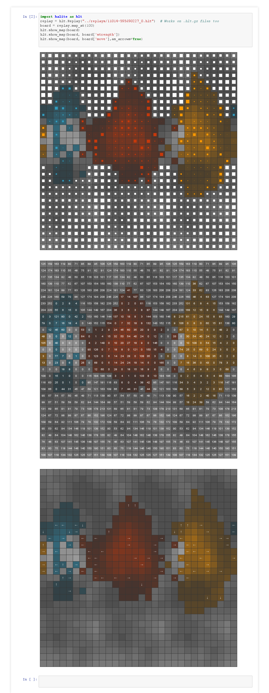

# Halite Notebook

Visualize Halite game information in Jupyter Notebook! 

	import halite as hlt
	replay = hlt.Replay("../replays/11014-595690227_0.hlt")  # Works on .hlt.gz files too
	board = replay.map_at(100)
	hlt.show_map(board)
	hlt.show_map(board, board['strength'])
	hlt.show_map(board, board['move'],as_arrows=True)

## Contributing

Pull requests welcome!